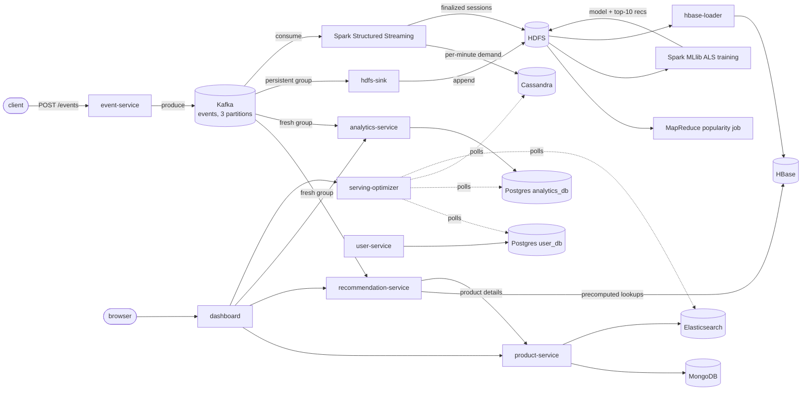

# Distributed E-Commerce Recommendation Analytics System

A Lambda Architecture pipeline built with Python, Kafka, and Spark to
turn e-commerce clickstream events into real-time recommendations,
batch analytics, and
[serving layer performance tuning](#serving-layer-performance-indexing-partitioning--refresh-intervals).

## Architecture (current)

`event-service` has no database of its own — Kafka *is* its durable
log. Every event flows through the `events` topic, and each downstream
consumer builds its own independent read model from it.

**Services** (each is its own FastAPI app or worker, own Docker image):

| Service | Port | Responsibility | Datastore |
|---|---|---|---|
| `product-service` | 8001 | Product catalog CRUD, enriched documents (tags, specs, images, geo location, rating) | MongoDB |
| `user-service` | 8002 | User CRUD | `user_db` (Postgres) |
| `event-service` | 8003 | Ingests view/cart/purchase events, publishes them to Kafka | Kafka only (no DB) |
| `recommendation-service` | 8004 | Consumes the `events` topic, builds an item-item similarity model in memory, serves recommendations | Kafka (event source only, stateless otherwise) |
| `analytics-service` | 8005 | Consumes the `events` topic independently, maintains rolling product/day counters | `analytics_db` (Postgres) |
| `hdfs-sink` | — | Consumes the `events` topic with a *persistent* consumer group, batches events into HDFS as the raw archive for the batch layer | HDFS (`/events/dt=YYYY-MM-DD/*.jsonl`) |

`recommendation-service` and `analytics-service` replay the full
topic on a fresh consumer group at startup, so they're restart-safe.
`hdfs-sink` is the exception — a persistent, committed-offset group,
since replaying from scratch would duplicate archived batches; it
flushes on a 500-event or 30-second window, whichever comes first.

Kafka runs in **KRaft mode** (no Zookeeper) on the official
`apache/kafka` image. HDFS runs as a single namenode + datanode, built
from a custom arm64 image (`infra/hadoop`) since the official Hadoop
images are amd64-only. Each remaining service owns its own Postgres
database (database-per-service, one shared container for local dev).

The `events` topic has 3 partitions, and producer calls don't set a
partition key, so Kafka round-robins events across them instead of
routing by `user_id`. That trades per-user ordering for even load
distribution -- fine here, since every consumer aggregates with
commutative counters or event-time windowing, not arrival order.

Full data flow, speed layer through batch layer through serving:



## Recommendation algorithm

`recommendation-service` implements **item-based collaborative
filtering**:

1. Every event (`view`, `add_to_cart`, `purchase`) is weighted (1, 3,
   5 respectively) and folded into an in-memory user→item and
   item→user interaction matrix.
2. Finds items similar to what the user already interacted with,
   using **cosine similarity** between interaction vectors.
3. Candidate items are scored by `similarity × the user's weight on
   the seed item`, summed across all the user's interactions, and
   ranked.
4. New users with no history fall back to a popularity ranking.

State is rebuilt on startup by replaying the Kafka topic, so the
service is stateless from a deployment standpoint.

## Batch layer: MapReduce

`jobs/product-popularity/` is a real Hadoop **MapReduce** job (via
Hadoop Streaming — plain Python mapper/reducer reading stdin/writing
stdout) that computes the same weighted popularity ranking as
`recommendation-service`'s fallback, but as a batch computation over
the full HDFS event archive:

1. **Mapper** emits `product_id -> weight` per archived event.
2. Hadoop's shuffle groups and sorts these by key.
3. **Reducer** sums weights per product using that sort order
   (compare-to-previous-key), not an in-memory dict.
4. A driver script sorts the result and writes the final ranked file
   to HDFS.

Runs via Hadoop's `LocalJobRunner` rather than YARN, to save a couple
of JVM services worth of memory for the rest of the stack.

It's a one-shot job, kept out of `docker compose up` behind a Compose
profile — see [Running locally](#running-locally).

## Speed layer: Spark Structured Streaming

`jobs/spark-streaming/session_and_anomaly.py` runs on a Spark standalone
cluster and reads the Kafka `events` topic live, running two
independent streaming queries:

1. **Session reconstruction** groups each user's events using Spark's
   `session_window` (5-minute inactivity gap by default), writing
   finalized sessions to HDFS once the watermark confirms they're closed.
2. **Per-product demand anomaly detection** counts events per product
   in 1-minute tumbling windows and flags a window as anomalous when
   it's more than 2.5 standard deviations from that product's running
   mean, computed incrementally with **Welford's online algorithm**.

A controlled 60-event burst produced a z_score of 32.17 and was
flagged by the detector (see Benchmarks) -- one test, not a claim of
general accuracy. Session and watermark durations are configurable
via env vars for faster local testing.

## ALS recommendation model (Spark MLlib)

`jobs/als-training/train_als.py` trains an **ALS (Alternating Least
Squares)** implicit-feedback model in Spark MLlib on the real, public
[RetailRocket e-commerce dataset](https://www.kaggle.com/datasets/retailrocket/ecommerce-dataset)
(~2.75M events over 4.5 months), using the same event-weighting scheme
as the rest of the project. Trained with `implicitPrefs=True`, since
view/cart/purchase counts are engagement signals, not ratings --
weight becomes ALS's confidence input, not a value to predict.

Evaluated on a held-out test split:

```
Precision@10 = 0.0055
```

RetailRocket is extremely sparse (median interactions per user is 1,
across ~1.4M users and ~235K items) -- the dominant reason the number
is low, not an implementation bug. Evaluation only counts users with
at least 5 interactions (`MIN_INTERACTIONS_FOR_EVAL`), since with 1-2
a held-out item is mostly noise; every interaction still trains the
model regardless. A production system would want richer item
features or a hybrid content + collaborative approach here.

The trained model and a precomputed top-10-recommendations table are
both persisted to HDFS.

## Serving layer: HBase

HDFS is fine for batch reads but isn't a point-lookup store, so a real
HBase cluster (master + regionserver + ZooKeeper, backed by actual
HDFS storage rather than standalone mode) serves the ALS output for
low-latency lookups:

```bash
curl http://localhost:8004/recommendations/precomputed/54
```

Measured point-lookup latency over the REST layer: **~10ms average**.

One caveat: the ALS model uses RetailRocket's own item ids, not this
project's demo catalog ids, so `/recommendations/precomputed/{id}`
can't be enriched through `product-service` like the other endpoints.

## Time-series analytics: Cassandra

Per-product, per-minute window counts (already computed for anomaly
detection) populate a Cassandra table, `product_demand_by_minute`,
partitioned by `(product_id, bucket_date)` so each partition holds
one product's counts for one day. Each write upserts the window's
current total rather than incrementing a counter, since Spark's
`update` mode would otherwise double-count.

`analytics-service` exposes it live:

```bash
curl http://localhost:8005/analytics/demand-timeseries/4269
```

## Product catalog: MongoDB

`product-service` runs on MongoDB rather than Postgres, storing
enriched, variable-shape product documents — `tags`,
`specifications`, `images`, a GeoJSON `location`, and `rating` — that
would be awkward as flat SQL rows. Product ids stay plain integers
via an atomic counter document (MongoDB has no built-in
auto-increment), since every other service keys on integer ids.

The catalog contains **300 Amazon products** — titles, brands,
prices, images, ratings, and ASINs — pulled from the public
[McAuley-Lab/Amazon-Reviews-2023](https://amazon-reviews-2023.github.io/)
dataset via `scripts/fetch_amazon_products.py`.

## Product search: Elasticsearch

`product-service` indexes every product for full-text search,
structured filters (category, brand, price range, minimum rating),
sort, and geo-distance filtering over the same warehouse location
MongoDB already stores:

```bash
curl "http://localhost:8001/products/search?q=noise+cancelling"
curl "http://localhost:8001/products/search?category=electronics&brand=Anker&price_max=50&rating_min=4&sort=rating_desc"
curl "http://localhost:8001/products/search?lat=30.2672&lon=-97.7431&radius_km=10"
```

Elasticsearch has no persistent volume here, so on restart
`product-service` reindexes everything from MongoDB (the actual
source of truth), and every new product is indexed immediately on
creation.

Runs single-node with `number_of_replicas=0` and security disabled --
fine for a local demo, but a real deployment would need a proper
cluster and auth in front of it.

## Serving Layer Performance: Indexing, Partitioning & Refresh Intervals

I added a small optimizer (`serving-optimizer`, port 8007) that
watches recent usage and adjusts Postgres, Cassandra, and
Elasticsearch based on what it's seeing. I based it on
[auto-indexing](https://github.com/nimit-pasricha/auto-indexing),
which does the same for Postgres alone -- I extended it to Cassandra
and Elasticsearch, reading telemetry straight from each store instead
of building a separate pipeline.

**Postgres: index creation and cleanup**

- *Problem:* nothing was watching `pg_stat_statements` for repeatedly
  filtered columns with no index to back them.
- *Solution:* every 15s poll, a column that crosses 20 calls since the
  last cycle gets `CREATE INDEX CONCURRENTLY`'d, gated by table-size
  (≥20 rows), cardinality (≥5% distinct values), and write/read ratio
  (≤3.0) guards so it doesn't index tiny tables, low-cardinality
  columns, or write-heavy ones. An index with no matching query for 3
  consecutive cycles gets dropped.
- *Trade-off:* it won't index a column for query patterns it hasn't
  seen yet, even if a human would.

**Cassandra: hot/cold partition rollups**

- *Problem:* `product_demand_by_minute` has one row per product per
  minute, so a wide-time-range dashboard query for a busy product
  reads a lot of rows for one number.
- *Solution:* each cycle sums every product's volume over the last 60
  minutes; products at or above 50 events get marked hot and get an
  hourly rollup in `product_demand_by_hour`, so wide-range queries
  read pre-aggregated hours instead of raw minutes. Recent partitions
  come from a separate `active_partitions` table (partitioned by date
  alone), not a scan of every partition `product_demand_by_minute`
  has ever had.
- *Trade-off:* at this project's data volume, partitions are nowhere
  near Cassandra's real large-partition threshold, so the rollup
  isn't solving a problem this demo's traffic actually has.

**Elasticsearch: refresh-interval tuning**

- *Problem:* the default 1s `refresh_interval` means every index
  write pays a near-real-time refresh cost, which is fine for one
  product at a time but wasteful during a bulk load.
- *Solution:* indexing ops are tracked per 15s window; crossing 15 ops
  in a window (above normal single-product-create traffic) raises
  `refresh_interval` to 5s until the burst passes, then resets it to 1s.
- *Trade-off:* products indexed during a burst take up to 5s instead
  of ~1s to become searchable; normal traffic is unaffected.

Decisions are logged to their own audit table and surfaced live in the
dashboard's Autonomous Tuning panel.

## Dashboard: Flask

A single web page (`http://localhost:8006`) ties everything above
together as a thin server-side proxy — the browser only ever talks to
Flask, never directly to the backend services.

- **Product Search** — full-text, filters, sort, and geo-search
  against Elasticsearch, with real product photos and a **View on
  Amazon** link built from each product's ASIN.
- **Top Products** and **Event Volume by Day** — Chart.js panels fed
  by `analytics-service`'s SQL aggregates.
- **Live Demand** — a polling Chart.js line chart backed by Cassandra,
  updated in real time by the Spark Streaming job.
- **Personalized Recommendations** — precomputed ALS recommendations
  served from HBase.
- **Autonomous Tuning** — a live feed of `serving-optimizer`'s
  decisions and status.

## Benchmarks

Measured locally on Docker Desktop, not a production cluster:

```
Kafka ingestion:         500-650+ events/sec sustained, 8 cores, all
                          requests returned 202 (scripts/kafka_load_test.py)
Kafka topic:              3 partitions, 1 broker, unkeyed (round-robin)
Spark trigger interval:   30s for both streaming queries
Anomaly detection:        one controlled 60-event/10s burst, flagged at z_score=32.17
ALS Precision@10:         0.0055 (RetailRocket, ~2.75M events, ~1.4M users)
HBase point lookup:       ~10ms average over the REST layer
```markdown
Product catalog:          300 Amazon products
```


## Running locally

Requires Docker and Docker Compose, with **at least 12GB** allocated
to Docker Desktop (Settings → Resources → Memory).

```bash
docker compose up --build
```

Starts every store and service, including the dashboard at
[http://localhost:8006](http://localhost:8006). Once the logs settle,
seed some sample data:

```bash
pip install requests
python scripts/seed_data.py
```

To measure ingestion throughput (see Benchmarks):

```bash
pip install httpx
python scripts/kafka_load_test.py --duration 15 --processes 8 --concurrency 32
```

To inspect the raw event archive `hdfs-sink` has written:

```bash
docker compose exec hdfs-namenode hdfs dfs -ls /events/dt=$(date +%Y-%m-%d)/
docker compose exec hdfs-namenode hdfs dfs -cat /events/dt=$(date +%Y-%m-%d)/*.jsonl
```

The namenode's web UI is also available at
[http://localhost:9870](http://localhost:9870).

To run the **MapReduce** popularity job over the HDFS archive:

```bash
docker compose --profile jobs run --rm mapreduce-product-popularity
```

To train the **ALS model**: download the RetailRocket dataset from
[Kaggle](https://www.kaggle.com/datasets/retailrocket/ecommerce-dataset)
(free account required), unzip into `data/retailrocket/` (gitignored),
then load it into HDFS and run the job:

```bash
docker cp data/retailrocket/events.csv <namenode-container>:/tmp/events.csv
docker compose exec hdfs-namenode sh -c \
  "hdfs dfs -mkdir -p /datasets/retailrocket && hdfs dfs -put -f /tmp/events.csv /datasets/retailrocket/events.csv"
docker compose --profile jobs up -d als-training
docker compose logs -f als-training
```

Then load those recommendations into **HBase**:

```bash
docker compose --profile jobs up hbase-load-recommendations
curl http://localhost:8004/recommendations/precomputed/54
```

Then try the API:

```bash
curl http://localhost:8004/recommendations/1
curl http://localhost:8004/recommendations/similar/3
curl http://localhost:8004/recommendations/popular

curl http://localhost:8005/analytics/top-products
curl http://localhost:8005/analytics/summary

curl http://localhost:8007/tuning/decisions
curl http://localhost:8007/tuning/status
```

Every service also exposes interactive API docs at
`http://localhost:<port>/docs` (FastAPI/Swagger UI).

To stop everything:

```bash
docker compose down        # stop containers, keep data
docker compose down -v     # stop containers and wipe volumes
```

## Tests

`tests/` covers pure logic that doesn't need the stack running: the
recommendation engine's cosine similarity, `sql_analyzer`'s query
classification, `pg_optimizer`'s call-delta math, the MapReduce
mapper/reducer, and event-service's Pydantic validation. Imports the
real service code directly, no Docker required:

```bash
pip install -r tests/requirements.txt
pytest
```

CI (`.github/workflows/ci.yml`) runs `compileall` and this suite on
every push and pull request.

## Setup notes

- **Memory**: per-container `mem_limit`s in `docker-compose.yml` sum
  to ~17GB, but that's a ceiling, not concurrent usage -- 12GB works
  in practice. Below that, Elasticsearch, Cassandra, or a Spark
  container is usually first to get OOM-killed (`Exited (137)`); give
  Docker Desktop more RAM or lower that service's `mem_limit`.
- **Apple Silicon**: `hdfs-namenode`/`hdfs-datanode` and the HBase
  services build from source instead of pulling an image, since the
  official Hadoop/HBase images are amd64-only -- the first
  `docker compose up --build` takes longer as a result.
- **Restarting a single service can leave others down**:
  `docker compose up -d <service>` only starts its dependency
  subgraph. After any interruption, prefer a plain `docker compose
  up -d` with no service name.
- **Kafka's default 7-day retention** applies to the `events` topic.
  After a long idle stretch, `recommendation-service`/
  `analytics-service` may restart with less history than expected —
  re-run `scripts/seed_data.py` to refill it.

## Project layout

```
.
├── docker-compose.yml
├── pytest.ini
├── .github/workflows/ci.yml     # compileall + pytest on push/PR
├── tests/                        # unit tests, see Tests above
├── infra/
│   ├── postgres/init-db.sql     # creates one database per service
│   ├── hadoop/                  # custom native-arm64 HDFS image
│   └── hbase/                   # custom native-arm64 HBase image
├── scripts/
│   ├── fetch_amazon_products.py # pulls 300 product records from Amazon-Reviews-2023
│   ├── seed_data.py             # loads data/amazon_products.json + simulated traffic
│   └── kafka_load_test.py       # measures real ingestion throughput
├── jobs/
│   ├── product-popularity/      # MapReduce mapper/reducer + driver script
│   ├── spark-streaming/         # Structured Streaming: sessions + anomalies + Cassandra writer
│   └── als-training/            # Spark MLlib ALS training + evaluation
├── data/
│   ├── amazon_products.json     # 300 Amazon products (committed -- small enough to track)
│   └── retailrocket/            # gitignored -- download separately, see below
└── services/
    ├── product-service/
    ├── user-service/
    ├── event-service/
    ├── recommendation-service/
    ├── analytics-service/
    ├── hdfs-sink/                # Kafka -> HDFS batching worker
    ├── hbase-loader/             # HDFS -> HBase recommendations loader
    ├── serving-optimizer/        # autonomous Postgres/Cassandra/ES tuner
    └── dashboard/                # Flask UI: search + live demand + recommendations
```

Each service directory follows the same shape:

```
<service>/
├── Dockerfile
├── requirements.txt
└── app/
    ├── main.py        # FastAPI routes
    ├── database.py    # SQLAlchemy engine/session (services with a DB)
    ├── models.py       # SQLAlchemy models
    ├── schemas.py      # Pydantic request/response models
    └── crud.py         # DB access helpers
```

## Trade-offs and lessons learned

- **Two disconnected id spaces.** ALS trains on RetailRocket's own
  item ids; the demo catalog has its own (see the HBase section) --
  `/recommendations/precomputed/{id}` can't be enriched through
  `product-service` as a result. In a v2 I'd train ALS on the demo
  catalog directly, or add an explicit id mapping.

- **Spark's `update` output mode was the trickiest bug to get
  right.** The Cassandra writer upserts each window's running total
  instead of incrementing a counter, since a naive increment
  double-counts every time Spark re-emits a window.

- **Autonomous systems need a real failure to prove themselves.**
  `serving-optimizer`'s Postgres tuner had nothing to act on until
  `user-service` had a real unindexed, filtered query in traffic --
  the `country` filter exists specifically to give it one.

- **Running ~20 containers on one machine is its own kind of ops
  work.** Every JVM-heavy store needed its own memory-limit tuning
  pass to stop them competing for the same 12GB -- a cost of the
  single-host demo, not of the architecture itself.

- **What I'd cut in a v2:** the in-memory CF model and the batch ALS
  model both rank products for a user with no blending strategy
  between them. A v2 would pick one, or define how they combine,
  instead of exposing both as separate endpoints.

## Why this project

I wanted to see what actually happens when one event stream has to
feed real-time recommendations, rolling analytics, a batch pipeline,
and a serving layer at the same time, instead of reading about Lambda
Architecture in the abstract. Building all four consumers off the
same Kafka topic surfaced problems a single-service tutorial never
would -- keeping the Cassandra writer correct under Spark's `update`
mode, or noticing partway through that the ALS model and the
in-memory CF model had no real relationship to each other. More on
that in [Trade-offs and lessons learned](#trade-offs-and-lessons-learned).

## AI assistance

I used Claude selectively during development for a limited amount of
documentation, test scaffolding, repetitive boilerplate, and code-review
feedback. I reviewed and adapted those suggestions before incorporating
them into the project.I remain responsible for the final code, tests, documentation, design
decisions, and reported results in this repository.

See [`docs/AI_ASSISTANCE.md`](docs/AI_ASSISTANCE.md) for details.

